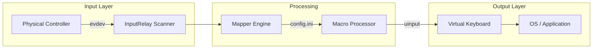

# InputRelay

InputRelay is a Linux utility that bridges physical input devices to a virtual keyboard. It intercepts events from hardware controllers (via `evdev`), maps them to macros or keystrokes, and injects them back into the system using the `uinput` kernel module.

This tool is useful for:
* Mapping game controller buttons to keyboard shortcuts.
* Creating macro sequences (Key press -> Wait -> Key press).
* Using controllers in applications that only support keyboard input.

## Architecture

InputRelay migrates away from `libusb` (used in previous versions) to the standard Linux Input Subsystem.


# Prerequisites

* Linux Kernel: Requires uinput support enabled
* Libraries:
    * ncurses (for the TUI)
* Permissions: Root access (sudo) is required to grab exclusive access to input devices

# Building
To build the project run:
```bash
make
```
This will compile the source files located in src/ and generate the inputrelay binary.</b>

To clean build artifacts:
```bash
make clean
```

# Usage

InputRelay must be run as root to access hardware devices

1.  Basic Execution </b>
    
    To start the relay, provide the name (or partial name) of the input device you wish to capture.

    ```bash
    sudo ./inputrelay "xbox"
    ```
    - The program will scan /dev/input/ for a device matching the string "xbox"
    - It grabs the device exclusively (the OS will stop seeing the original controller)
    - Input events are translated according to config.ini `config.ini`

2.  Daemon Mode

    To tun the relay in the background:

    ```bash
    sudo ./inputrelay --daemon
    ```

3.  Configure Interface (TUI)

    To launch the ncurses-based configurator:
    
    ```bash
    sudo ./inputrelay --configure "sony"
    ```

    - Note: The configurator currently only supports capturing inputs and generating basic configuration entries. Manual editing of `config.ini` is recommended for complex macros.

# Configuration

Mappings are defined in `config.ini` in the root directory

Syntax:
```ini
[MAPPINGS]
TRIGGER_BUTTON = ACTION_1, ACTION_2, ...
```

* Triggers are the standard Linux event names (e.g., BTN_SOUTH)
* ACtions:
    * Keys: KEY_A, KEY_ENTER, KEY_SPACE
    * Delays: WAIT_ms (e.g., WAIT_100 for 100ms of delay)

Example:
```ini
[MAPPINGS]
# Remap 'A' button (South) to type "HI" and press Enter
BTN_SOUTH = KEY_H, WAIT_50, KEY_I, WAIT_50, KEY_ENTER

# Remap 'B' button (East) to Spacebar
BTN_EAST = KEY_SPACE
```

# Project Structure
* `src/main.c`: Entry point and main event loop
* `src/input/`: Handles scanning /dev/input/event*` and device grabbing
* `src/mapping/`: Config parsing and macro translation logic.
* `src/output/`: Virtual device creation via ioctl on /dev/uinput.
* `src/ui/`: Ncurses interface implementation.
